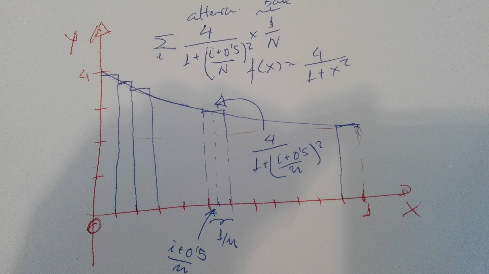

# Retos para la práctica p6-t2-microservices

## Reto 1: Granja de Trabajadores

En el paradigma de paralelismo conocido como *Farm* o *Granja de
Procesadores* la tarea que se quiere realizar es dividida en un subconjunto de sub-tareas 
bastante mayor que el número de procesadores disponibles. 
1. Un procesador denominado maestro o capataz envia las
tareas a los restantes procesos-trabajadores. 
2. Tan pronto como un trabajador devuelve el resultado de una subtarea el capataz le envía una
nueva subtarea. 
3.  El capataz combina el resultado parcial con los que
haya obtenido hasta ese momento para ir cosntruyendo la solución a la tarea inicial. 

Una ventaja que tiene este paradigma es que consigue equilibrar la carga de trabajo entre las máquinas,
* independientemente de que estas sean heterogéneas o no, 
* independientemente de cual sea la carga dinámica de las estaciones por la presencia
de otros procesos y usuarios e 
* independientemente de que las tareas sean heterogéneas en sus necesidades de tiempo de cómputo.

En el siguiente código mostramos como usar los sockets ROUTER  y DEALER de 0MQ junto 
con los clusters de Node.js para  crear un borrador de una granja de trabajadores:

**Fichero connecting-robust-microservices-chapter-4/microservices/dealer.js**

```js
'use strict';

const PORT = require("./port.js");
const ins = require("./ins.js");
const cluster = require("cluster");
const zmq = require("zeromq");

const numWorkers = require("os").cpus().length;

const randomBetween = (min, max) => Math.floor(Math.random() * (max - min) + min);

function workerTask() {
  const dealer = zmq.socket('dealer');
  dealer.identity = process.env["identity"]; 

  console.log("identity "+dealer.identity+
              " process "+process.pid+" port = "+PORT);

  dealer.connect('tcp://localhost:'+PORT);

  let total = 0;

  const sendMessage = () => dealer.send(['ready']);

  //  Get workload from broker, until finished
  dealer.on('message', function onMessage(...args) {
    // console.log("Inside Worker. args = "+ins(args.map(x => x.toString())));
    const workload = args[0].toString('utf8');
    //console.log("Inside Worker. workload = "+workload);

    if (workload === 'stop') {
      console.log('Completed: '+total+' tasks ('+dealer.identity+' '+process.pid+')');
      dealer.removeListener('message', onMessage);
      // https://nodejs.org/api/events.html#events_emitter_removelistener_eventname_listener is a method of EventsEmitter
      dealer.close();
      return;
    }
    total++;

    // Simulate some work
    setTimeout(sendMessage, randomBetween(0, 500));
  });

  //  Tell the broker we're ready for work
  sendMessage();
}

function main() {
  const broker = zmq.socket('router');
  //broker.bindSync('tcp://*:5671');
  broker.bind('tcp://*:'+PORT);

  let endTime = Date.now() + 5000
    , workersFired = 0;

  broker.on('message', function (...args) {
    // console.log("Inside Master. args = "+ins(args.map(x => x.toString())));
    const identity = args[0]
      , now = Date.now();

    if (now < endTime) {
      broker.send([identity, 'more work']);
    } else {
      broker.send([identity, 'stop']);
      workersFired++;
      if (workersFired === numWorkers) {
        setImmediate(function () { // See https://nodejs.org/api/timers.html#timers_setimmediate_callback_args
          broker.close();
          cluster.disconnect();
        });
      }
    }
  });

  for (let i=0;i<numWorkers;i++) {
    cluster.fork({identity: "worker"+i});
  }
}

if (cluster.isMaster) main();
else workerTask();
```

* The ROUTER socket, unlike other sockets, tracks every connection
it has, and tells the caller about these. 
* The way it tells the caller is to stick the connection **identity** in front of each message
received
* An **identity**, sometimes called an **address**, is just a binary
string with no meaning except *"this is a unique handle to the
connection"* 
* Then, when you send a message via a ROUTER socket, you first send an identity frame.

Cuando ejecuto este programa, obtengo una salida parecida a esta:

```
[~/.../microservices(master)]$ node dealer.js 
identity worker0 process 56820 port = 60300
identity worker2 process 56822 port = 60300
identity worker3 process 56823 port = 60300
identity worker1 process 56821 port = 60300
Completed: 24 tasks (worker3 56823)
Completed: 22 tasks (worker2 56822)
Completed: 19 tasks (worker1 56821)
Completed: 18 tasks (worker0 56820)
```

Usando 0MQ y paralelismo de granja, compute en paralelo una aproximación al número π aprovechando la siguiente fórmula:

$$
\int_{0}^{1} \frac{4}{(1+x^2)} dx  = 4 \arctan(x) |_{0}^{1}\ = 4 ( \frac{\pi}{4} - 0) = \pi 
$$

Para computar π aproxime la integral mediante sumas de áreas de rectángulos:



1. El capataz divide el intervalo \[0,1\] en un número de subintervalos bastante mayor que el número de trabajadores
2. El capataz  le indicará a cada trabajador para que intervalo debe calcular el  área 
3. El trabajador computa el área haciendo la correspondiente suma de Riemann y la devuelve al capataz, 
4. El capataz añade dicha subárea al acumulador de área computada.
4. El capataz envía un nuevo intervalo al trabajador si quedan intervalos por computar. En caso contrario envía un mensaje de parada.


## Reto 2: Chat

Escriba un chat de línea de comandos - con rooms - usando 0MQ.

1. Use el patrón PUB/SUB. 
2. Use el "tópico" del patrón PUB/SUB para implantar las rooms
   1. En el servidor:

      ```js
           publisher.send( ["room-1", // topic
                              JSON.stringify(
                                {
                                  type: "message",
                                  from: user,
                                  content: content
                                }
                              )
                            ]
      ```
   2. En el cliente:

      ```js
      subscriber.on("message", (room, data) => {
        console.log(room.toString());
        const message = JSON.parse(data);
        ...
      });
      ```
3. En el cliente, para la lectura desde teclado use [readline](https://nodejs.org/api/readline.html#readline_readline). Sigue un ejemplo:

  Fichero **local/src/javascript/learning/readline-examples/small-cli.js**

  ```js
  const readline = require('readline');

  const rl = readline.createInterface({
    input: process.stdin,
    output: process.stdout,
    prompt: 'DSI> '
  });

  const bye = () => {
    console.log('Have a great day!');
    process.exit(0);
  };

  const methods = {
    hello: () => console.log("world"),
    exit: () => bye(),
    default: (line) => console.log(`Say what? I might have heard '${line.trim()}'`),
  };

  rl.prompt();

  rl.on('line', (line) => {
    const choice = line.trim();
    if (choice in methods) methods[choice]();
    else methods['default'](line);
    rl.prompt();
  }).on('close', () => bye);
  ```
4. El cliente envía sus mensajes al servidor usando un socket 0MQ  REQ/REP.
El cliente envía su mensaje al servidor como un request JSON indicando la *room* a la que va dirigida. 
El servidor, una vez recibe el mensaje en el socket REQ/REP, lo 
publica a los clientes conectados a la room especificada usando el socket PUB/SUB

