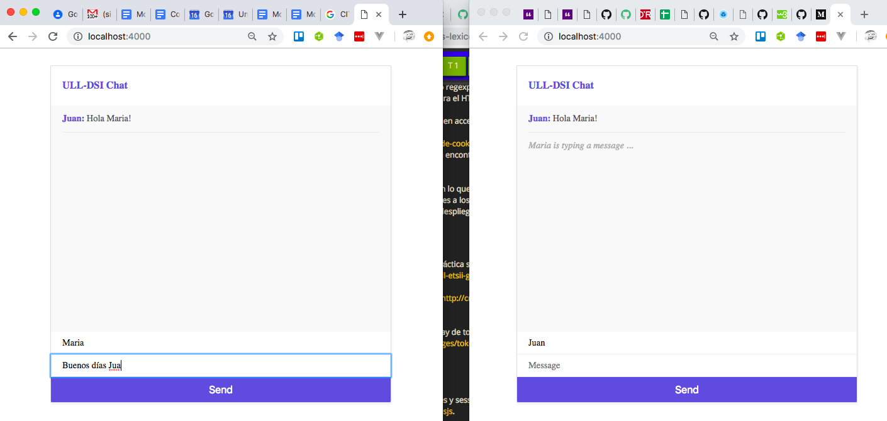

# Reto para la práctica p5-t3-websockets

* Add *{user} is typing ...* functionality.



## Tip: Decida en que lugar del documento saldrá el mensaje `... is typing`

En el HTML, deberá decidir donde va a aparecer el mensaje de *feedback* indicando que un usuario
esta tecleando y añadirle un `id`.` `Por ejemplo: 

```html
<div id="feedback"></div>
```

## Tip: Como escuchar por las pulsaciones de teclas

Le puede ayudar añadir en el código del cliente una llamada a el método `addEventListener`:

```js
target.addEventListener(tipo, listener);
```

* `tipo`: Una cadena representando el  tipo de evento a escuchar. 
  - The [keydown](https://developer.mozilla.org/en-US/docs/Web/Events/keydown) event is fired when a key is pressed down.
  - Unlike the [keypress](https://developer.mozilla.org/en-US/docs/Web/Events/keypress) event, the keydown event is fired for all keys, regardless of whether they produce a character value.
* `listener`: normalmente la function que será llamada cuando ocurre el evento `tipo` sobre el elemento del DOM representado por `target`. En este caso el código de `listener` deberá emitir un mensaje indicando que el usuario esta tecleando.
  - El server debería recoger el mensaje y hacer un broadcast del mismo al resto de clientes conectados
